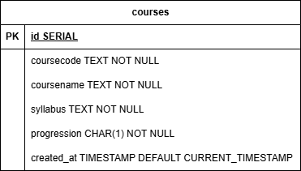

# ◈ Laboration 1
Detta repository innehåller laboration 1 för kursen DT207G.


## ✦ Projektbeskrivning
Denna webbplats tillåter användaren att spara kurser via ett formulär som sedan visas upp på en annan undersida. All data lagras i en PostgresSQL databas.

## ⚙ Funktioner
* **EJS:** EJS används som view engine och tillåter enkel användning av JavaScript kod tillsammans med HTML i samma fil. 
* **Validering:** All data som ska lagras valideras innan insättning för att undvika felaktiga, skdaliga och tomma värden.
* **Nodemon:** Nodemon övervakar ändringar i koden under utveckling och startar automatiskt om servern vid sparade ändringar.

## ✦ ER-Diagram


## ⌨ Installation & Setup

1. **Klona projektet:**
   ```bash
   git clone https://github.com/CLR2001/DT207G-Laboration1.git
   ```
2. **Installera beroenden:**
   ```bash
   npm install
   ```
3. **Starta projektet:**
   ```bash
   npm run dev
   ```
   Eller
   ```bash
   npm run build
   npm run preview
   ```

## ⬀ Länk till webbplats
[Webbplats](https://dt207g-laboration1.onrender.com/)

## ⬢ Utvecklare
**Ludvig Rosenqvist** — *Student*
🔗 [GitHub](https://github.com/CLR2001)
